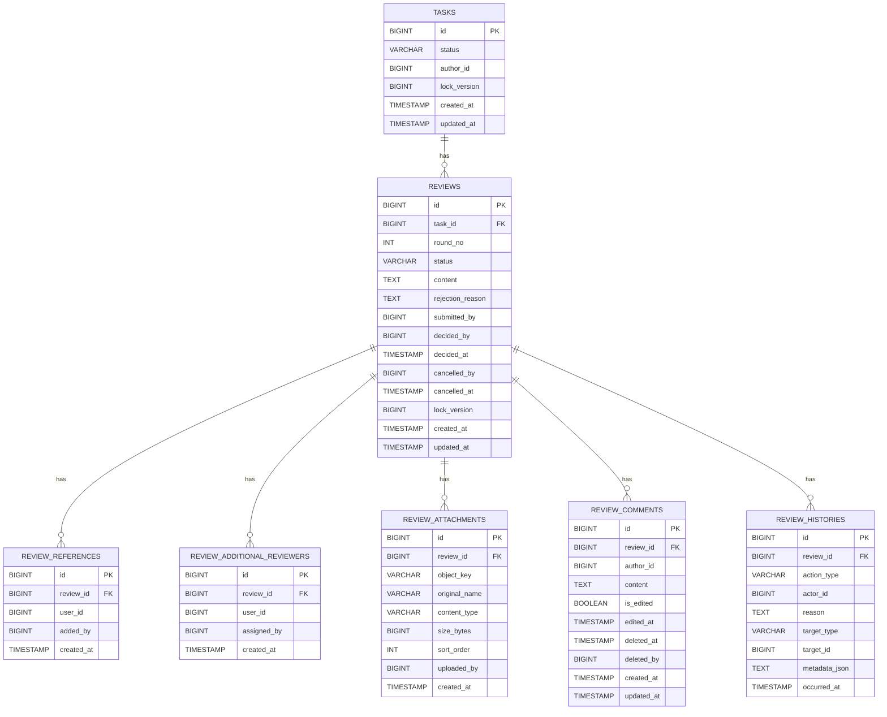

# 검토 도메인 ERD

## 1. 테이블 역할

- `tasks`: 검토 대상 업무
- `reviews`: 검토 본체
- `review_references`: 참조자
- `review_additional_reviewers`: 추가 검토자
- `review_attachments`: 첨부 자료
- `review_comments`: 후속 대화
- `review_histories`: 감사/이력

## 2. ERD

## 3. 관계 요약

- `tasks` 1 : N `reviews`
- `reviews` 1 : N `review_references`
- `reviews` 1 : N `review_additional_reviewers`
- `reviews` 1 : N `review_attachments`
- `reviews` 1 : N `review_comments`
- `reviews` 1 : N `review_histories`

## 4. 상태 기준

### 업무 상태

- `IN_PROGRESS`
- `IN_REVIEW`
- `COMPLETED`

### 검토 상태

- `SUBMITTED`
- `APPROVED`
- `REJECTED`
- `CANCELLED`

## 5. 상태 전이 규칙

- 검토 생성 가능 조건: 업무 상태가 `IN_PROGRESS`
- 검토 생성 처리 결과: 업무는 `IN_REVIEW`, 검토는 `SUBMITTED`
- 승인: `SUBMITTED -> APPROVED`
- 반려: `SUBMITTED -> REJECTED`
- 취소: `SUBMITTED -> CANCELLED`
- 재상신: 기존 검토 재사용 없이 새 `reviews` row 생성
- 재상신 시 `round_no` 증가
- 승인 시 업무 상태: `COMPLETED`
- 반려 시 업무 상태: `IN_PROGRESS`
- 취소 시 업무 상태: `IN_PROGRESS`

## 6. 설계 메모

- 업무에는 비즈니스 버전 개념이 없다.
- 검토는 `round_no`로 몇 번째 검토 사이클인지 기록한다.
- 동시성 제어는 `tasks.lock_version`, `reviews.lock_version` 같은 JPA 낙관적 락 컬럼으로 처리한다.
- 한 업무에는 동시에 `SUBMITTED` 상태의 검토가 하나만 존재할 수 있다.
- `APPROVED`, `REJECTED`, `CANCELLED` 상태에서는 검토 본문/첨부/참조자/추가 검토자 수정이 불가하다.
- `APPROVED` 상태에서는 신규 코멘트 작성만 허용한다.
- `REJECTED` 상태에서는 코멘트 작성/수정/삭제 모두 불가하다.
