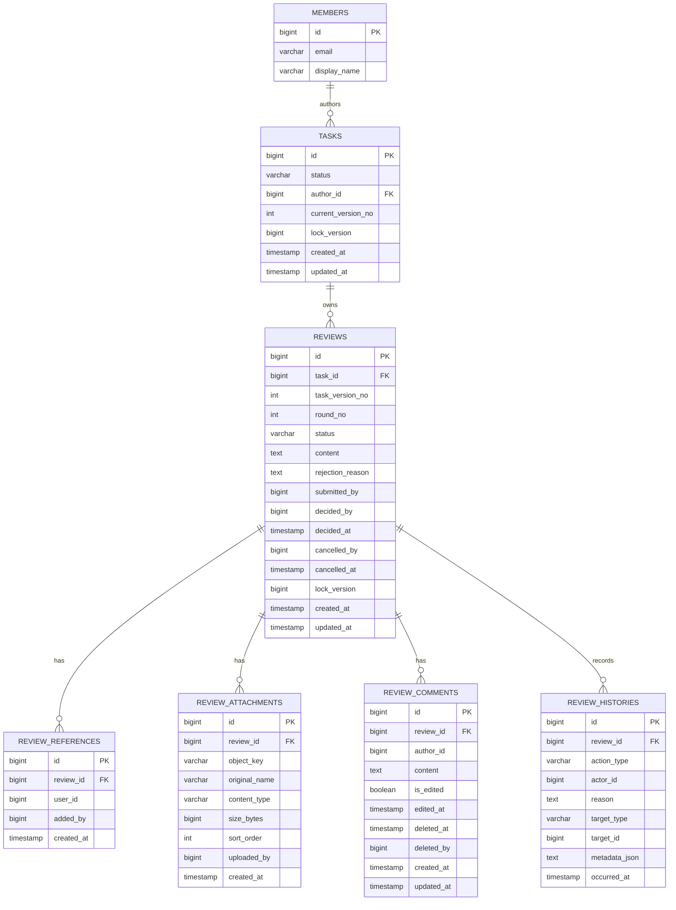

# 검토 도메인 ERD

## Mermaid ERD



## 관계 설명

- `tasks 1 : N reviews`
  - 업무 버전 단위로 검토 라운드가 쌓인다.
- `reviews 1 : N review_references`
  - 검토 참조자는 검토별로 독립 관리한다.
- `reviews 1 : N review_attachments`
  - 첨부는 별도 버전을 두지 않고 검토 본체의 일부로 취급한다.
- `reviews 1 : N review_comments`
  - 코멘트는 후속 커뮤니케이션이며 공식 검토 본문을 대체하지 않는다.
- `reviews 1 : N review_histories`
  - 상태 전이와 세부 이벤트를 모두 감사 로그로 남긴다.

## 인덱스 및 제약

| 대상 | 제약/인덱스 | 목적 |
| --- | --- | --- |
| `reviews(task_id, task_version_no)` | PostgreSQL partial unique index where `status = 'SUBMITTED'` | 동일 업무 버전의 유효 검토 중복 방지 |
| `reviews(task_id, round_no)` | unique | 같은 업무 안에서 라운드 번호 중복 방지 |
| `review_references(review_id, user_id)` | unique | 참조자 중복 할당 방지 |
| `review_histories(review_id, occurred_at desc)` | index | 타임라인 조회 최적화 |
| `review_comments(review_id, created_at desc)` | index | 코멘트 최신순 조회 최적화 |
| `review_attachments(review_id, sort_order)` | index | 첨부 정렬 순서 유지 |

## PostgreSQL 메모

```sql
create unique index uk_reviews_task_version_submitted
    on reviews (task_id, task_version_no)
    where status = 'SUBMITTED';
```

- JPA 애노테이션만으로 partial unique index를 완전 표현하기 어렵기 때문에, 실제 마이그레이션 단계에서는 별도 SQL 또는 Flyway/Liquibase 스크립트로 생성한다.
- `metadata_json`은 1차 MVP에서 `text`로 두고, 운영 요구가 생기면 `jsonb`로 승격한다.

